# QuillWork

**QuillWork doesn't just help you write your novel. It understands the story you're writing.**

A private, local novel-writing workspace. Everything feeds one structured model of your story (characters, relationships, causality, who knows what and when, world rules, open promises), and every tool reads from it. It runs on your own computer, against an AI model you choose, and your writing never leaves your machine.

100% local, no subscription, no account.

[**Get beta access, free**](https://quillwork.agile-growth.net/beta) &nbsp;|&nbsp; [**Watch the demo video**](https://quillwork.agile-growth.net/demo) &nbsp;|&nbsp; [**User manual**](USER_MANUAL.md) &nbsp;|&nbsp; [Website](https://quillwork.agile-growth.net/)

[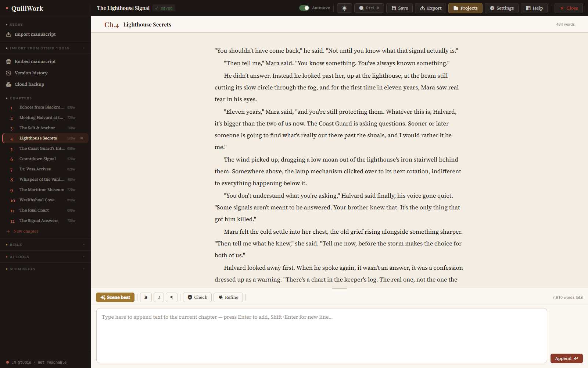](https://quillwork.agile-growth.net/demo)

*Click the picture to watch the full walkthrough on YouTube.*

---

## Contents

- [Feature overview](#feature-overview)
- [Screenshots](#screenshots)
- [Beta registration](#beta-registration)
- [System requirements](#system-requirements)
- [Privacy statement](#privacy-statement)
- [Frequently asked questions](#frequently-asked-questions)
- [User manual](#user-manual)
- [Beta application form](#beta-application-form)

---

## Feature overview

### Four things a tool that understands your story can tell you

- **Ask.** "What does Elizabeth actually know about Darcy's letter right now?" Chat answers from your real Bible, your search index and the story analysis, grounded in what has actually been written so far, not a guess.
- **Check.** "Does this chapter contradict anything I've established?" Continuity check reads the whole Bible, not just the current scene, and names exactly which fact it disagrees with.
- **Analyse.** "Which characters or promises are being neglected?" The Story Analyst's health report scores the whole manuscript, tracks the score as you revise, and grounds every finding in the exact sentence that caused it.
- **Write.** "Give me three ways to get from here to there." The A to B Bridge proposes distinct paths, each keyed to what your characters would actually do, not a generic beat sheet.

### Four pillars, one structured model

- **Understand.** Builds a structured model of your story: characters, relationships, causality, who knows what, world rules, and the research you pin beside it, feeding every tool from the same source.
- **Check.** Continuity, knowledge and worldbuilding checks read the whole Bible and name exactly what a passage contradicts.
- **Develop.** The Story Analyst maps causality as a graph you can correct, counts who actually drives the plot, tracks promises and open questions, and scores structural health over time, each finding grounded in the exact sentence that caused it.
- **Create.** Scene beat, Refine and the A to B Bridge write and revise prose using everything the model already knows about your story, with an anti-AI-prose system (banned cliches, sentence-variety rules) baked into every generation.

### The practical side

- **Manuscript import.** Drop in an existing draft, or bring it from Scrivener, Obsidian, Aeon Timeline, Word or ODT. QuillWork splits chapters and extracts characters, locations, relationships, facts and plot threads automatically.
- **Runs on your own model.** LM Studio or Ollama, whatever you already have loaded. Not sure which model? The optional Quick AI setup picks and downloads one to match your hardware. Uncensored and creative-writing models are fully supported.
- **No wiki to maintain.** As you write, the model updates the Bible itself: new characters, relationships and plot threads are tracked automatically. Anything that would change an existing entry waits for your say-so.
- **A research wall that reads.** Pin maps, faces, PDFs, notes and spreadsheets into nested topics. QuillWork reads them, and continuity check can name the reference a passage contradicts.
- **Export when done.** Word, PDF, EPUB, Markdown or industry-standard manuscript format, with your bold, italic, colour and embedded images intact.
- **Undo at the scale of a draft.** Automatic version snapshots you can compare and restore, plus backup to your own cloud folder. Nothing depends on a server we run.
- **Updates you control.** QuillWork can tell you when a newer version is out and what changed. You choose Update now or Decline, and nothing is downloaded until you say so.

Three themes (light, sepia and dark), and the interface is available in English (UK and US), French, German and Spanish.

---

## Screenshots

### The story bible

| | |
|---|---|
| 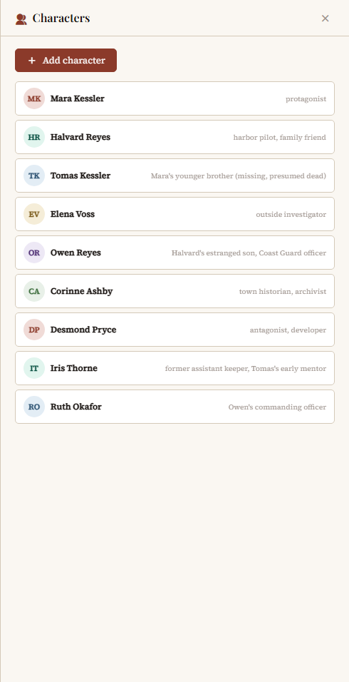 | 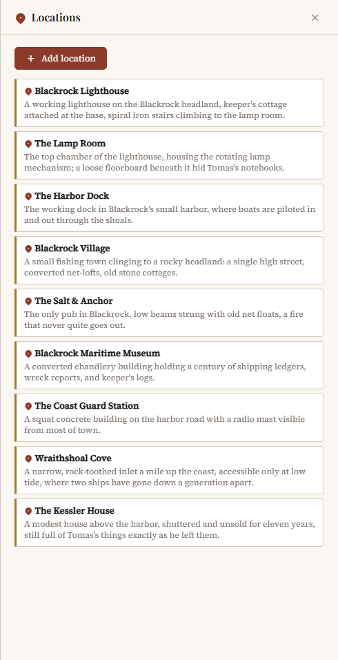 |
| **Characters.** Roles, personality, history, secrets and arcs. | **Locations.** Each with its own description and details. |
| 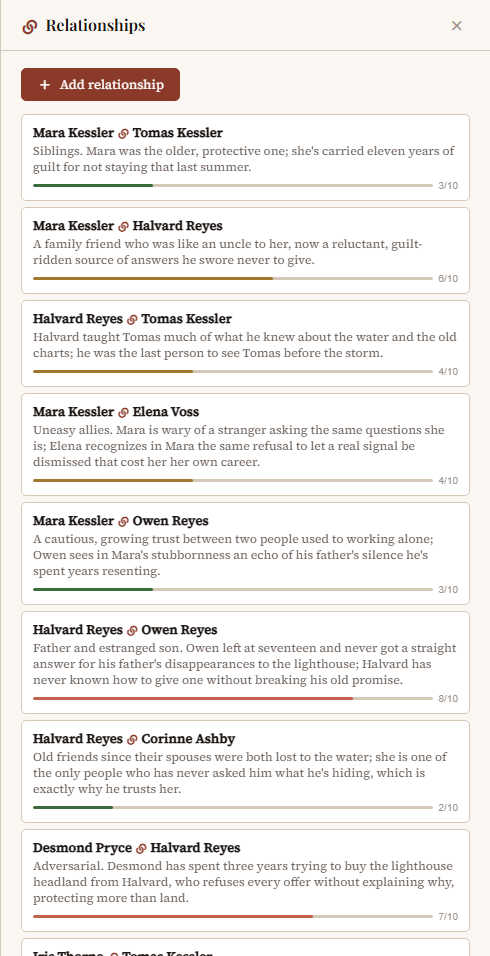 | 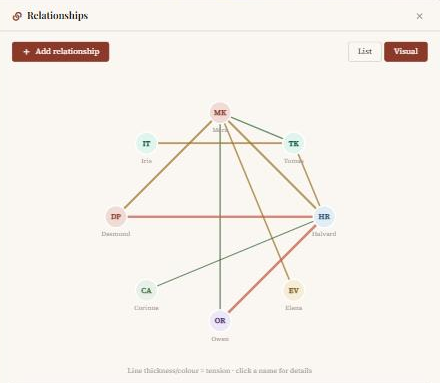 |
| **Relationships (list).** Every relationship gets a dynamic and a tension score, coloured green to red. | **Relationships (visual).** A web of who is connected to whom, and how tense each link is. |
| 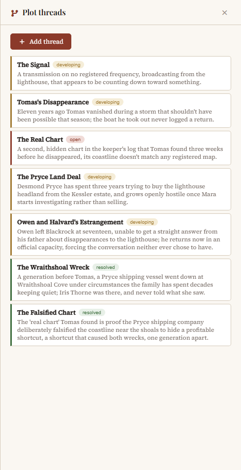 | 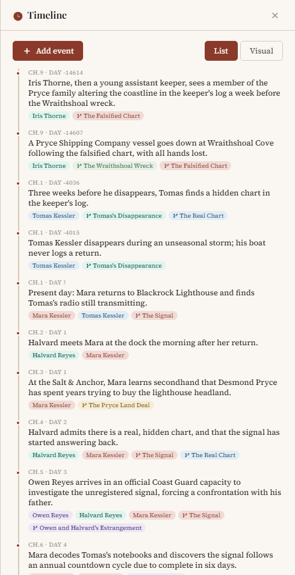 |
| **Plot threads.** Each thread tracks its own status so nothing is quietly dropped. | **Timeline.** Events by chapter and day, tagged with characters and threads. |
| 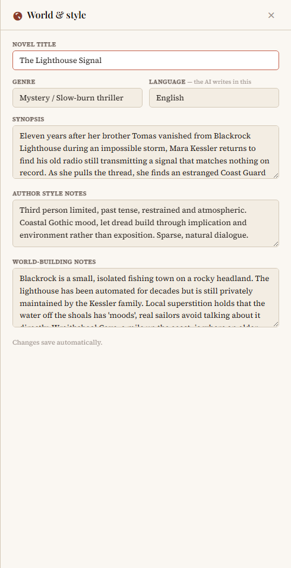 | 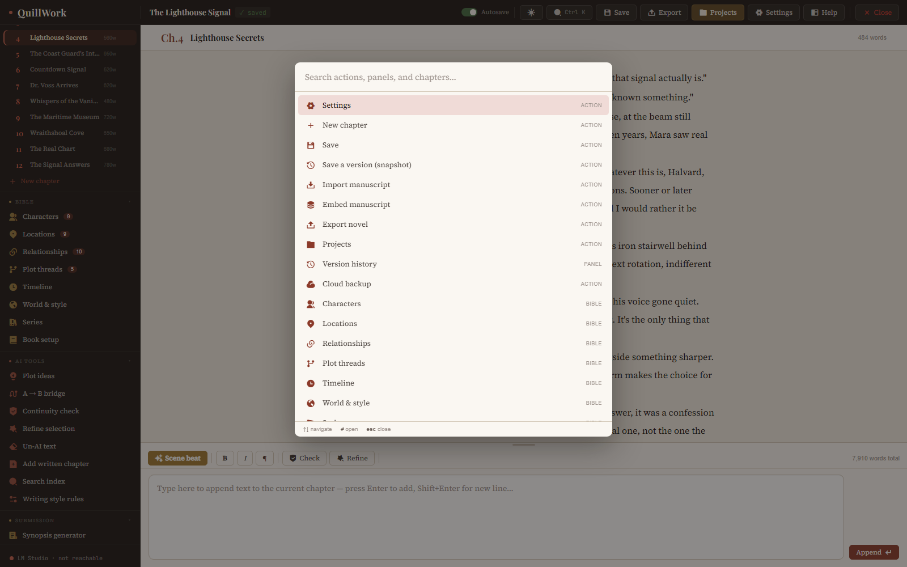 |
| **World and style.** The rules of your world and the voice of your book. | **Command palette.** Press Ctrl+K to jump to any action, panel or chapter. |

### Continuity and knowledge

| | |
|---|---|
| 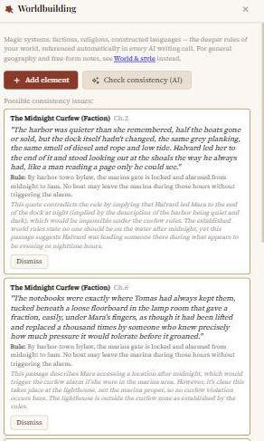 |  |
| **Worldbuilding consistency.** Flags a passage that breaks a rule you already established. | **Continuity check.** Reads the whole Bible and names what a passage contradicts. |
| 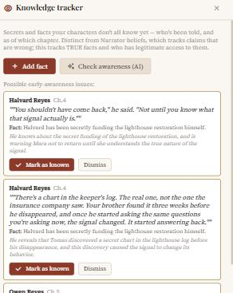 | 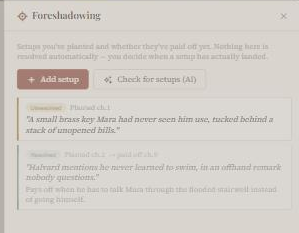 |
| **Knowledge tracker.** Who knows what, since when, and who acts on something they have not been told. | **Foreshadowing.** Planted setups and whether they were paid off. |

### The Story Analyst

| | |
|---|---|
| 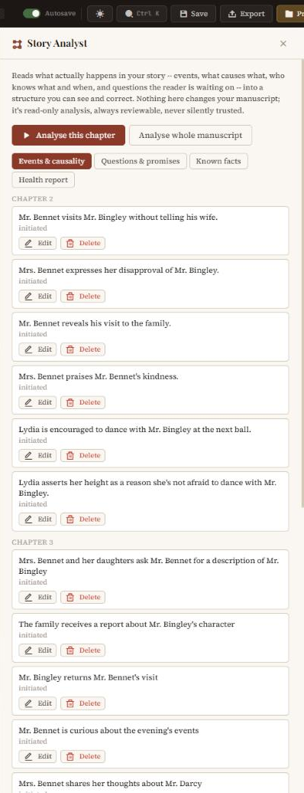 | 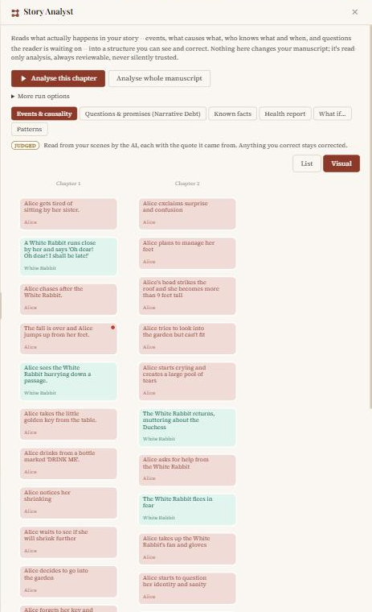 |
| **Events and causality.** Every event is tied to the sentence it came from, and you can correct it. | **Causality graph.** Events as boxes by chapter, coloured by who acted, with irreversible events marked. |
| 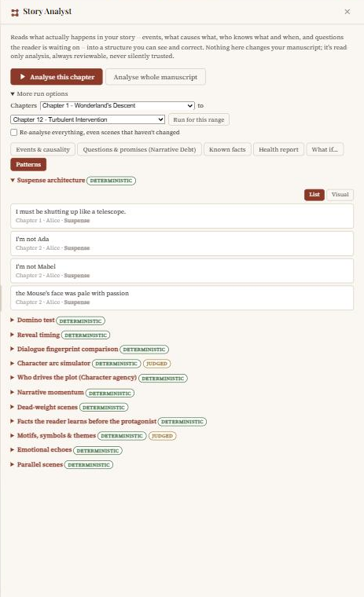 | 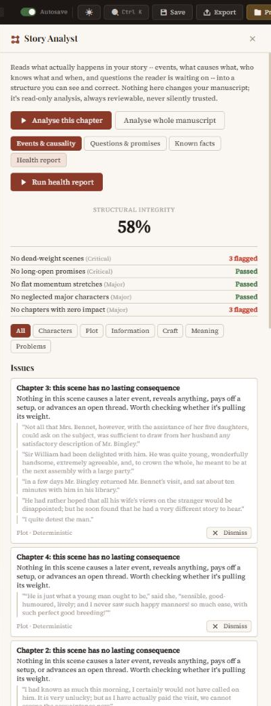 |
| **Patterns.** Each analysis is marked Deterministic (calculated) or Judged (by the model), so you always know which you are looking at. | **Health report.** A structural score, five named checks, and issues each grounded in a quoted passage. |

### Creative tools and output

| | |
|---|---|
|  | 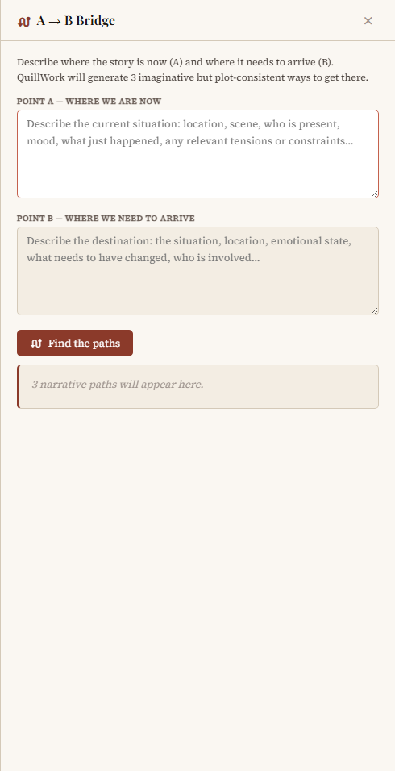 |
| **Plot ideas.** Suggestions keyed to your Bible, not to a generic template. | **A to B Bridge.** Distinct paths from one point in the story to another. |
| 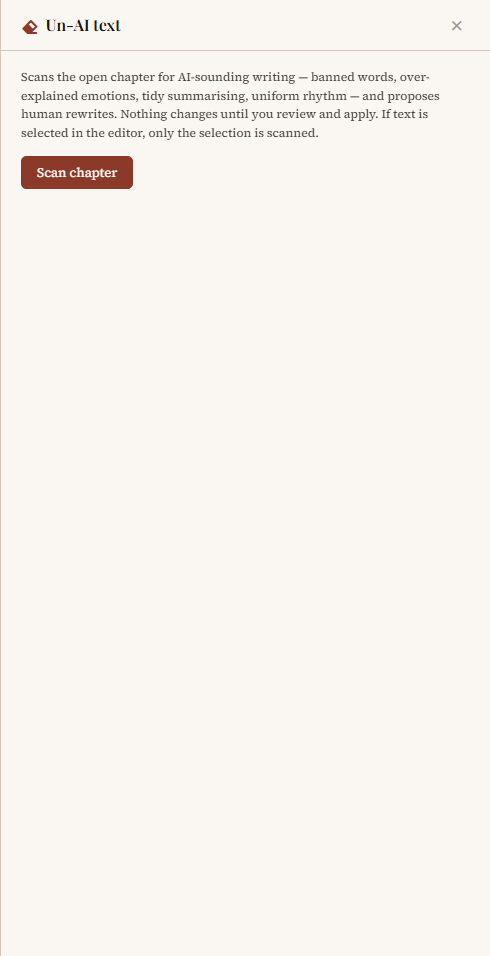 | 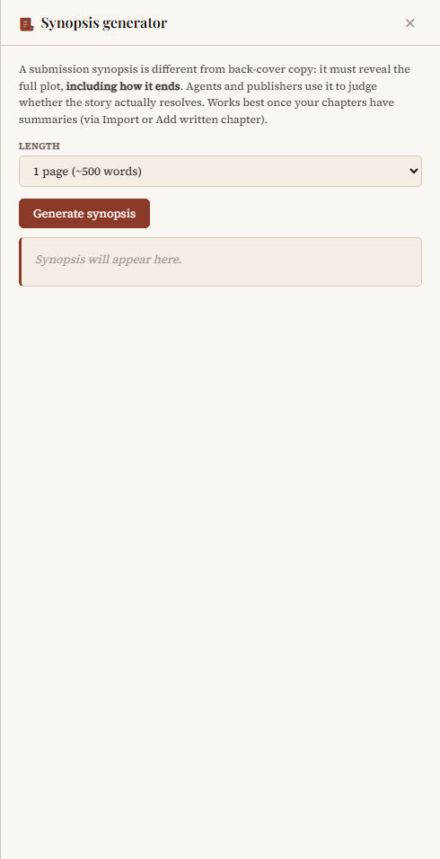 |
| **Un-AI text.** Scans a chapter for the habits that make prose read as machine-written. | **Synopsis generator.** A submission synopsis or back-cover copy, at the length you choose. |
| 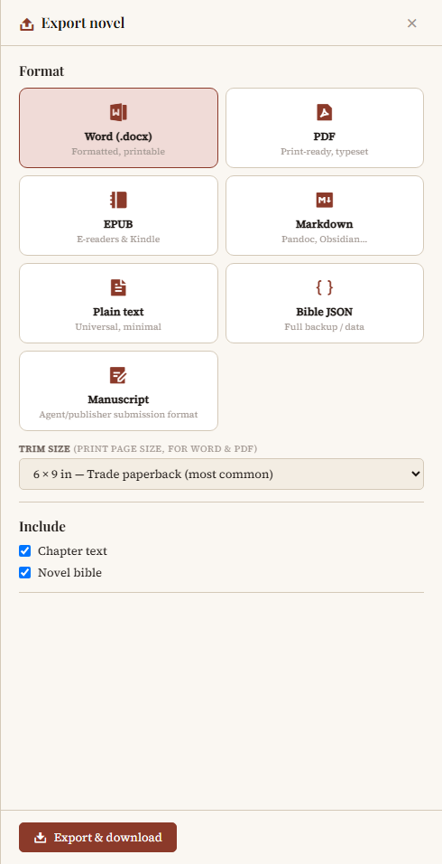 | |
| **Export.** Word, PDF, EPUB, Markdown, plain text, Bible JSON and manuscript format. | |

### Three themes

| Light | Sepia | Dark |
|---|---|---|
|  | 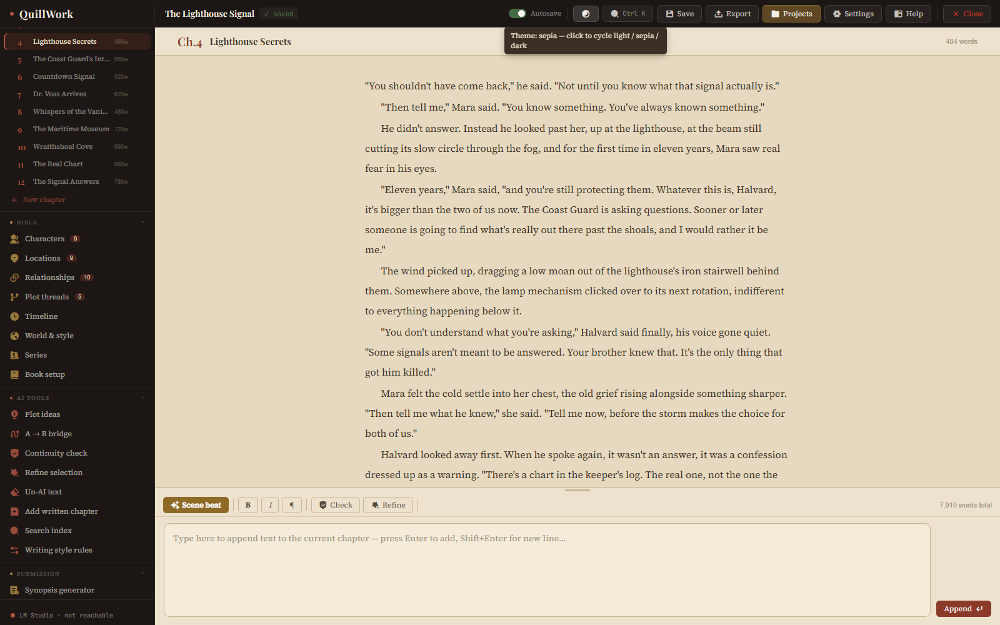 | 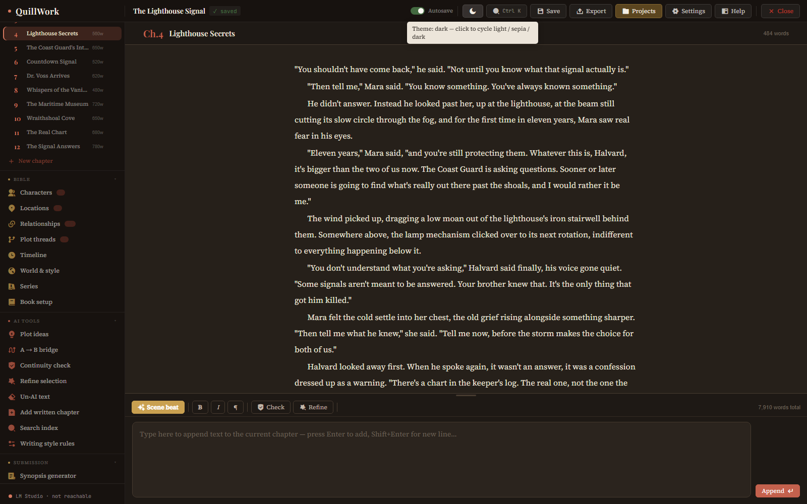 |

---

## Beta registration

QuillWork is in a free public beta: a small, steadily growing group of writers running it against their own local models.

1. **Apply.** Fill in the [beta application form](https://quillwork.agile-growth.net/beta) with your name and email. There is no credit card and no account.
2. **Check your inbox.** Your licence key and a download link arrive by email straight away.
3. **Install.** On Windows, click the link to download the installer and double-click it. On Linux, run the small downloader from the email. Either way, QuillWork sets itself up, downloading what it needs the first time.
4. **Activate your key.** Paste it into QuillWork when asked. Activating needs an internet connection for a moment; after that QuillWork runs offline.
5. **Connect a model.** Install LM Studio or Ollama and load a model, or use the optional Quick AI setup, which reads your hardware and recommends one.
6. **Send a beta report.** Your key runs for 28 days. Send back a short beta report before it expires (the **Beta report** button in QuillWork opens the form) and you get a permanent free licence, no strings attached.

A key belongs to one install at a time. If you reinstall or move to a new computer, activate the same key again and it moves across. A key can move to a new install up to three times before you need to email.

**Apply for the beta:** https://quillwork.agile-growth.net/beta

---

## System requirements

| | |
|---|---|
| **Operating system** | Windows 10 or 11 (64-bit), or Linux (x86_64 or ARM64). A Mac version is not available yet. |
| **Memory** | 16 GB RAM recommended, 8 GB minimum. |
| **Graphics card** | 12 GB of VRAM recommended. Smaller setups work too; generation is just slower as more of the model runs from system memory. |
| **AI software** | [LM Studio](https://lmstudio.ai) or [Ollama](https://ollama.com), running a model. QuillWork does not include or run a model itself. |
| **Internet** | Needed for the first-time install, for activating a key, and for the update check (which you can switch off). Otherwise QuillWork runs offline. |

### What different hardware runs comfortably

| Hardware | What suits it |
|---|---|
| **12 GB VRAM / 16 GB RAM** (the common gaming-PC setup) | A 14B uncensored model at Q5 fits fully in VRAM and runs fast, with roleplay-grade prose and a 32k context. If you are willing to offload into system RAM, a 27B to 32B model runs, just slower. |
| **16 GB VRAM / 32 GB RAM** (a solid mid-range card) | A 14B model at full 8-bit precision is the sweet spot, with room for a large context window. 27B to 32B models fit tightly if you cap the context under 8k tokens. |
| **24 GB VRAM / 64 GB RAM** (the high-end tier) | Room for a 27B to 32B uncensored generalist at good quantisation with a long context, or a fast 14B at near-maximum precision if you prefer speed over depth. |

Fiction with any mature content needs an uncensored or abliterated model: a standard safety-tuned model will refuse or soften those scenes however you prompt it. QuillWork itself never filters or censors anything. Model choice also matters a great deal for prose quality, because the model you load is the writer.

---

## Privacy statement

**Your writing stays on your computer.** QuillWork does not receive, see or store your manuscript, your Bible or anything you write with it. It talks only to an AI model that you run yourself, through LM Studio or Ollama, at an address you set (normally this same computer). A cloud AI option is planned but is not built yet, so in this beta nothing goes to a hosted service. If you choose to point QuillWork at a model server on another computer, such as running the Fast model elsewhere, your text goes to that server, so use one you trust.

**What QuillWork sends to QuillWork's server.** Two things, and nothing else:

- **Key activation.** When you activate a key, QuillWork sends the key and a random install ID (not tied to your hardware) so a key can be limited to one install at a time. This happens when a key is first activated on an install; after that QuillWork checks your key on your own computer.
- **Update check.** A few seconds after QuillWork starts, and whenever you press **Check for updates**, QuillWork sends your licence key, the version you are running and your platform (Windows or Linux). None of your writing, projects, Bible or settings is included. You can switch the start-up check off in Settings; nothing is downloaded until you choose **Update now**.

There is no analytics and no telemetry. **Diagnostic capture** is off by default; if you turn it on, QuillWork keeps a short rolling copy of its own messages on your computer so you can save a diagnostic bundle to attach to a bug report. QuillWork never sends it anywhere, and the bundle never includes your chapters or Bible.

**The website and beta form.** The beta form collects your name, your email address and, only if you choose to say, where you heard about QuillWork. They are used to issue your key, email you the download link and contact you about your beta. Your key and a record of your signup are kept in a private list on QuillWork's server. If you send a beta report, the answers you give, your email and the version you were running are stored the same way. Emails are sent through an email delivery service. This website has no advertising and no tracking cookies. Your details are not sold or shared for marketing.

To ask what is held about you, or to have it deleted, email [marc@agile-growth.net](mailto:marc@agile-growth.net).

---

## Frequently asked questions

**Is there a catch, a subscription, an account?**
No account and no subscription. Your licence key is valid for 28 days as a beta tester. Send back a short beta report before it expires and you get a permanent free licence, no catch.

**What happens after the 28 days if I don't send a report?**
Your key simply expires and QuillWork stops opening until you renew it. Sending a beta report before then is what unlocks a permanent free licence. It does not have to be long, just real feedback on what worked and what did not.

**Does my writing ever leave my computer?**
No. QuillWork talks only to an AI model you run yourself, through the OpenAI-compatible APIs of LM Studio or Ollama, on your own machine. A cloud AI option is planned but is not built yet, so in this beta nothing you write is sent to a hosted service. See the [privacy statement](#privacy-statement) for the little that QuillWork does send to its own server.

**LM Studio or Ollama, which one do I need?**
Either. QuillWork supports both, and defaults to the standard port for whichever you pick (1234 for LM Studio, 11434 for Ollama). Use whichever you already have. If you have neither, the optional Quick AI setup opens Ollama's official download page and then downloads a model that fits your hardware for you.

**What if I don't know which model to pick?**
Let Quick AI setup choose: it reads your GPU memory and RAM and recommends a writing model, a vision model and, where there is room, a fast one, then downloads them through Ollama. To pick yourself, start with a well-regarded uncensored model of around 8B to 14B parameters in a Q4 or Q5 quantisation. It is the most forgiving starting point across most hardware, and you can try something bigger or smaller once you see how it runs.

**Do I need a powerful GPU?**
It helps, but it is not required. 16 GB RAM and 12 GB VRAM is the recommended baseline for a good experience. Smaller setups still work; generation is just slower as more of the model spills into system memory.

**Can I write mature or explicit fiction?**
Yes, as long as the model you load can. A standard safety-tuned model will refuse or soften those scenes regardless of prompting, so mature fiction needs an uncensored or abliterated model. QuillWork itself does not filter anything.

**Can I bring in a book I have already started?**
Yes. Import a manuscript, or bring your work from Scrivener, Obsidian, Aeon Timeline, Word or ODT. QuillWork splits chapters and extracts characters, locations, relationships, facts and plot threads for you to review.

**Does it work on a Mac?**
Not yet. QuillWork runs on Windows 10 and 11 and on Linux.

**Can I work with other people on the same book?**
No. QuillWork is a single-writer, local tool. Real-time collaboration needs accounts and syncing, which would go against keeping your writing private and needing no account.

**How do I get updates?**
QuillWork can check for a newer version and tell you what changed. You choose **Update now** or **Decline**. If a new version fails to start, your old one is put back automatically, and your projects are never touched.

**Where do I report a bug or ask a question?**
Use the **Beta report** button in QuillWork's top bar, or email [marc@agile-growth.net](mailto:marc@agile-growth.net).

---

## User manual

The complete guide to QuillWork, from setting up your AI model to the Story Analyst, importing, exporting, backups, updates and a full function reference: **[USER_MANUAL.md](USER_MANUAL.md)**. It is the same manual that is built into QuillWork and published at https://quillwork.agile-growth.net/docs.

---

## Beta application form

**[Apply for the QuillWork beta](https://quillwork.agile-growth.net/beta)**: your name and email, and your licence key and download link arrive in your inbox.

**[Watch the demo video](https://quillwork.agile-growth.net/demo)**

---

&copy; 2026 QuillWork. All rights reserved. This repository contains the public description of QuillWork only; the application itself is not open source.
